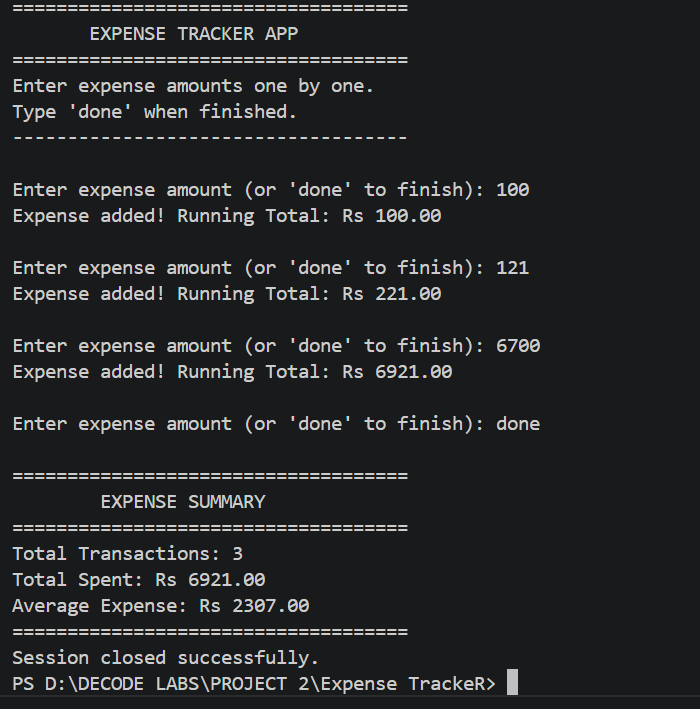

# Decodelab-Task-2-Aqsa-Ismail


A Python command-line Expense Tracker that accumulates real-time expense data and displays a complete financial summary.

---

## 📌 Overview

Built as **Task 2** of my **DecodeLabs Internship (Batch 2026)**.

DecodeLabs is a virtual internship program that trains students to think like real backend developers. Task 2 — *The Architecture of Financial Truth* — wasn't about simple arithmetic. It was about **Data Accumulation**: mastering how to store, update, and process numerical data in real-time using pure mathematical and programmatic logic.

This project proves I can build a state-preserving backend engine that handles continuous data entry with absolute precision.

---

## 🚀 Features

- 💸 Enter multiple expense amounts one by one
- 🔄 Running total updates after every entry
- ⚠️ Rejects invalid input — no crash on wrong data
- 🚫 Rejects negative or zero amounts
- 🔢 Tracks total number of transactions
- 📊 Displays average expense in final summary
- 🛑 Clean exit with `done` — prints full summary

---

## 📸 Demo



---

## 💻 Output

```
====================================
       EXPENSE TRACKER APP
====================================
Enter expense amounts one by one.
Type 'done' when finished.
------------------------------------

Enter expense amount (or 'done' to finish): 100
Expense added! Running Total: Rs 100.00

Enter expense amount (or 'done' to finish): 50
Expense added! Running Total: Rs 150.00

Enter expense amount (or 'done' to finish): 20
Expense added! Running Total: Rs 170.00

Enter expense amount (or 'done' to finish): ten
Invalid Data! Please enter numbers only.

Enter expense amount (or 'done' to finish): -5
Amount must be greater than 0!

Enter expense amount (or 'done' to finish): done

====================================
        EXPENSE SUMMARY
====================================
Total Transactions: 3
Total Spent: Rs 170.00
Average Expense: Rs 56.67
====================================
Session closed successfully.
```

---

## ⚙️ How to Run

> Make sure Python 3 is installed on your system.

```bash
git clone https://github.com/aqsaismail04/Decodelab-Task-2-Aqsa-Ismail.git
cd Decodelab-Task-2-Aqsa-Ismail
python Expense-Tracker.py
```

---

## 📂 Project Structure

```
Decodelab-Task-2-Aqsa-Ismail/
│
├── Expense-Tracker.py    # Main application file
├── runtime.png           # Program screenshot
├── LICENSE
└── README.md
```

---

## 🧠 Concepts Practiced

- Accumulator Pattern (`total = total + expense`)
- While Loop with Sentinel Value (`done` to exit)
- Type Conversion (`float()` for decimal amounts)
- Input Validation (negative/zero rejection)
- Exception Handling (`try/except ValueError`)
- Transaction Counter
- Average Calculation
- Formatted Output (`:.2f` for precision)

---

## 💡 What I Learned

During this internship task, I gained hands-on experience with:

- The **Accumulator Pattern** — the heartbeat of every financial system
- Why `total` must be initialized **outside** the loop to preserve state
- **Defensive coding** — catching `ValueError` so invalid input never crashes the program
- Using **sentinel values** (`done`) to gracefully shut down a continuous loop
- The difference between holding data (storage) and processing it (computation)
- How a simple `total += expense` scales to power real-world banking systems

---

## 👩‍💻 Author

**Aqsa Ismail**
CS Student @ University of Central Punjab, Lahore
🔗 [GitHub](https://github.com/aqsaismail04) | [LinkedIn](https://linkedin.com/in/aqsaismail04)
